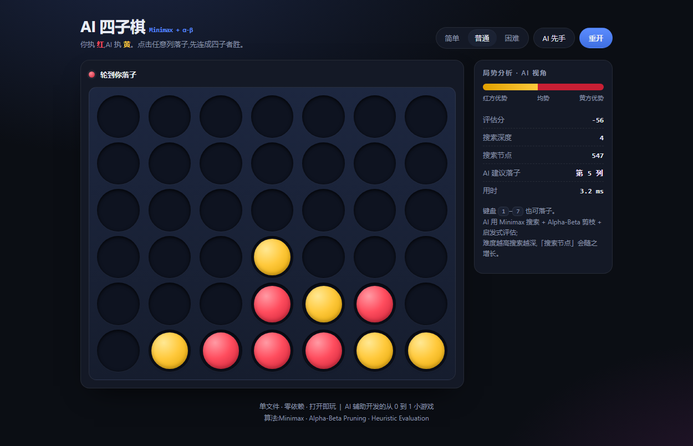

# AI 四子棋 · Minimax Connect Four

一款**单文件、零依赖、打开即玩**的网页小游戏:你执红,AI 执黄,先连成四子者胜。
AI 使用 **Minimax 搜索 + Alpha-Beta 剪枝 + 启发式局势评估**,并带一个**实时局势分析面板**(评估分 / 搜索深度 / 搜索节点数 / 建议落子 / 用时)。

> 玩法:点击任意列落子(或键盘 `1`–`7`)。难度越高,AI 搜索越深、越难赢。



---

## ✨ 特性

**游戏侧**
- 7×6 标准四子棋规则;横、竖、两条对角线四连判胜
- 三档难度(搜索深度 2 / 4 / 6)与先后手切换
- 落子动画、获胜高亮、响应式布局(桌面 / 移动端均可玩)
- 键盘操作、一键重开

**AI / 算法侧**
- **Minimax** 对抗搜索 + **Alpha-Beta 剪枝**(中间列优先的走子排序,提升剪枝效率)
- **启发式评估函数**:滑窗统计双方「二连 / 三连」威胁,叠加中心列控制权重
- **胜负分带深度惩罚**:优先「更快赢、更慢输」
- 终局检测与「三连必防」权重,避免低级漏防
- 全程记录**搜索节点数**与**耗时**,直观展示剪枝效果

**数据 / 展示侧**
- 实时**评估分**经 logistic 映射为「红方优势 ↔ 均势 ↔ 黄方优势」优势条
- 展示 AI 的搜索深度、节点数、建议落子与决策耗时

---

## 🧠 算法说明

| 环节 | 做法 |
|---|---|
| 状态表示 | `6×7` 二维数组,`0=空`、`1=人类`、`2=AI` |
| 走子生成 | 仅列未满可落子,按 **中心列优先** 排序(提升 α-β 剪枝率) |
| 评估函数 | 枚举所有长度 4 的滑窗;混合窗口记 0;三连/二连加权,防守权重高于进攻 |
| 搜索 | Minimax + Alpha-Beta;根节点按估值择优 |
| 终止 | 四连判胜(带深度惩罚)/ 棋盘填满判和 |

**复杂度直觉**:朴素 Minimax 的分支因子约 7、深度 d 时节点约 7^d;Alpha-Beta 在理想走子排序下可把有效分支降到约 √7,实际在同一局面下**节点数从数万降到数百**(可在面板的「搜索节点」直接看到)。

---

## 🚀 运行

无需构建、无需安装依赖:

```bash
# 方式一:直接双击打开
index.html

# 方式二:起个静态服务器(推荐,便于移动端调试)
npx serve .
# 或
python -m http.server 8000
```

## 📁 项目结构

```
ai-connect4/
├── index.html      # 全部内容:结构 + 样式 + 游戏逻辑 + AI
├── screenshot.png   # 截屏
└── README.md
```

单文件是为了「分享/嵌入成本最低」——把这个 `index.html` 丢到任何静态托管(GitHub Pages / Vercel / 对象存储)就能玩。

## 🛠 开发说明

本项目是我从 0 到 1 独立完成的小游戏实践:在需求拆解、结构设计、算法实现、UI 打磨与调试环节中**全程使用 AI 编码工具链**辅助,由我负责算法正确性验证与玩法/数值手感调校。

- 算法正确性:通过构造「必须堵三连 / 必须抢先连四」等局面回归验证;
- 性能:面板中的节点数与耗时即为每次决策的实测值。

## 📄 License

MIT
